<h3><code>javid@github ~ $ ./contributions.sh</code></h3>

  

<h3><code>javid@github ~ $ neofetch --profile</code></h3>

<table border="0" cellpadding="0" cellspacing="0">
  <tr>
    <td valign="top" width="370" align="center">
      
    </td>
    <td valign="top" width="490" align="center">
      
    </td>
  </tr>
</table>

 

  
  
  

---

### 🚀 Production Architectures & Flagship Builds

* [**PolicyPulse AI**](https://github.com/Md-javid/PolicyPulse-AI) — 🥇 *Top Project Winner, GDG New Delhi HACKFEST 2.0*  
  Autonomous compliance engine that ingests GDPR/SOC2 policies, scans databases, and runs a 4-agent ReAct loop (Security, Privacy, Vendor, Ops) to remediate vulnerabilities.  
  `FastAPI` • `LangGraph` • `Gemini` • `MongoDB` • `Docker`

* [**Aura-NPU**](https://github.com/Md-javid/AURA-NPU) — 🎖️ *AMD Slingshot Hackathon*  
  100% on-device multimodal assistant running offline on the AMD Ryzen AI XDNA 2 NPU (~100ms latency). Features 22 Indian languages, ADHD task chunking, and SHA-256 integrity logs.  
  `Python` • `AMD Ryzen AI NPU` • `VitisAI ONNX` • `NiceGUI`

* [**BillAgent Pro**](https://github.com/Md-javid/personal-pf) — 🏅 *4th Place, AI Agentathon*  
  Multi-agent expense intelligence system utilizing Gemini Vision OCR with sequential validation and dynamic learning loops.  
  `Django 5` • `React 19` • `Gemini Vision` • `TypeScript`

* [**MediCode AI**](https://github.com/Md-javid/MediCode-AI) — 🏥 *Clinical EHR Automation*  
  Clinical EHR coding platform automating ICD-11, CPT, and SNOMED CT extraction from doctor notes with HL7 FHIR R4 compliance.  
  `React 19` • `Django 5` • `Gemini Flash` • `Docker` • `FHIR`

* [**MarketMind AI**](https://github.com/Md-javid/marketmind-ai) — 📈 *SNS GenAI Sprint*  
  Autonomous competitor intelligence pipeline that scrapes competitor websites in real time with Playwright, generates SWOT matrices, and sends automated WhatsApp alerts.  
  `Next.js 14` • `FastAPI` • `LangGraph` • `Playwright`

* [**KSP IntelliCrime**](https://github.com/Md-javid/datathon-26) — 🚔 *Datathon 2026*  
  Agentic law enforcement dashboard with bilingual (English/Kannada) FIR search, suspect network mapping, and one-click Twilio emergency alerts for field officers.  
  `Streamlit` • `Gemini` • `Twilio` • `Python`

* [**Personal Agentic Portfolio**](https://github.com/Md-javid/personal-pf) — 🌐 *Live on [mohamedjavid.dev](https://mohamedjavid.dev)*  
  Interactive portfolio featuring a live LangGraph state machine, WebGL fluid dynamics, SQLite RAG chatbot ("Ask Javi"), and Nginx/PM2 AWS EC2 deployment with CI/CD.  
  `Next.js 16` • `React 19` • `FastAPI` • `Tailwind CSS` • `AWS EC2`

---

  Generated with self-typing animated SVG • Auto-updated daily via GitHub Actions • Built by <b>Mohamed Javid</b>

